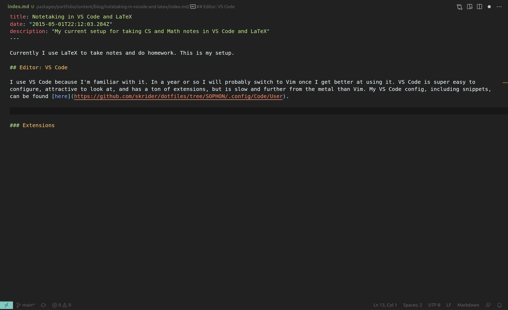

Currently I use LaTeX to take notes and do homework. This is my setup. I got a lot of inspiration from [Gilles Castel's Blog](https://castel.dev/post/lecture-notes-3/).

## Editing

I use VS Code because I'm familiar with it. In a year or so I will probably switch to Vim once I get better at using it. VS Code is super easy to configure, attractive to look at, and has a ton of extensions, but is slow and further from the metal than Vim. My VS Code config, including snippets, can be found [here](https://github.com/skrider/dotfiles/tree/SOPHON/.config/Code/User).

I like to keep VSCode lean, and use it exclusively as a text editor. I'm a big fan of the Unix "many small sharp tools" philosophy. To do so, I've used the following extensions:

- [Monkey Patch](https://marketplace.visualstudio.com/items?itemName=iocave.monkey-patch) - inject custom JS into the VS Code runtime, whatever that entails. Lets you mess with the UI directly.
- [Customize UI](https://marketplace.visualstudio.com/items?itemName=iocave.customize-ui) - the consumer of Monkey Patch, Customize UI gives you enhanced control over the appearance.
- [LaTeX Workshop](https://marketplace.visualstudio.com/items?itemName=James-Yu.latex-workshop) - a bunch of features for writing LaTeX such as auto build, snippets, and preview. A little bloated, and has trouble running shell commands on Linux, but pretty good.

## Building

I use [Pandoc](https://pandoc.org/MANUAL.html) to transform my `.md` files into LaTeX and then [pdflatex](https://www.tug.org/texlive/) to build the resulting output. Builds are triggered on file save. Files are watched using [entr](https://github.com/eradman/entr), transformed, and built.

## Previewing

Now it gets a little hairy. To keep the scroll location of my preview in sync with my cursor in VSCode, I maintain two git repos in the same directory, `.git` and `.tracker`. `.git` is committed to manually and used to track large-scale changes of the repo. `.tracker` is committed to on file save. Then, the location of the first diff in the `pandoc`-generated file is calculated using `git diff`, and my PDF viewer [zathura](https://github.com/pwmt/zathura) is automatically scrolled to the corresponding location in the output file using a sourcemap generated by [SyncTeX](http://itexmac.sourceforge.net/SyncTeX.html). Complicated, but works pretty well.
